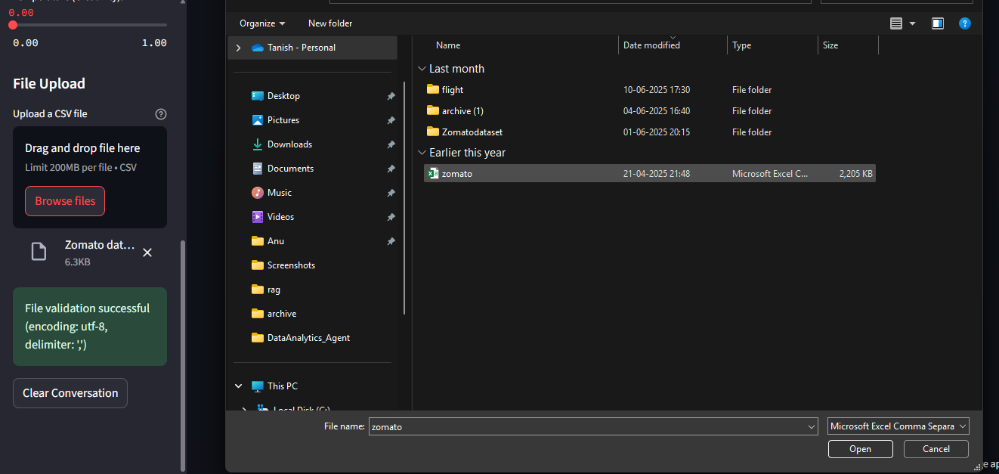
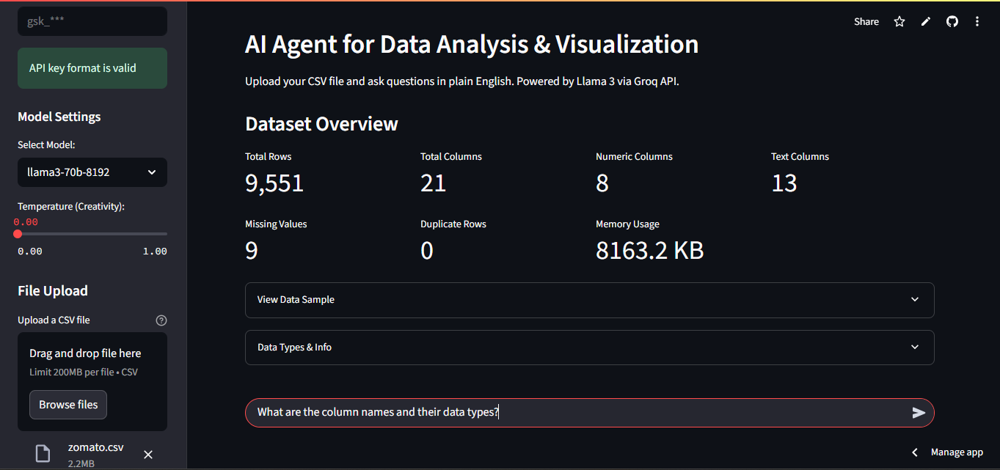
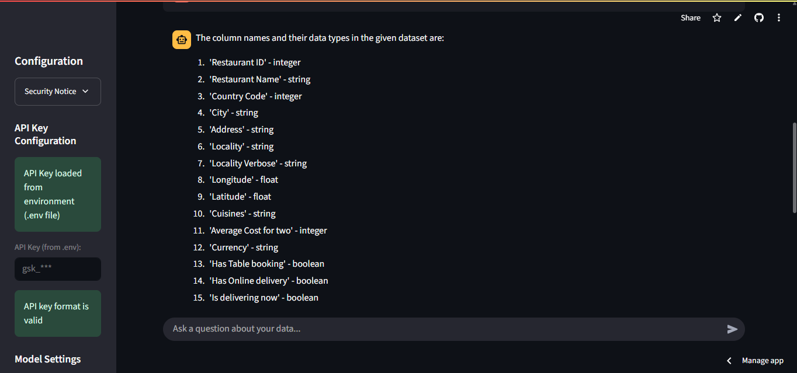
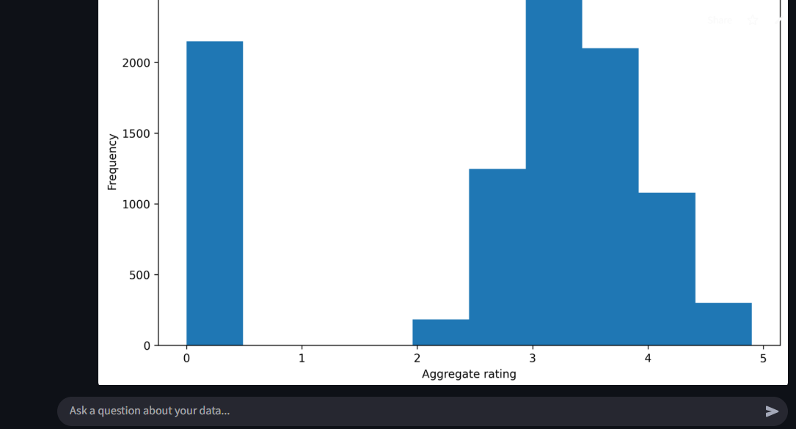

# INSIGHT 📰


**AI-Powered Data Analysis & Visualization Agent**

INSIGHT is an intelligent data analysis tool that allows you to upload CSV files and interact with your data using natural language queries. Powered by high-end LLMs via Groq API, it generates textual insights, creates **multiple visualizations**, and performs complex data analysis tasks through an interactive conversational interface.

## ✨ Features

- **Natural Language Queries**: Ask questions about your data in plain English.
- **Multi-Plot Generation**: Generate and display multiple charts, graphs, and plots automatically per query.
- **Data Quality Assessment**: Identify missing values, duplicates, and data types.
- **Interactive Chat Interface**: Conversation-based data exploration.
- **Multiple Model Support**: Choose from various high-end LLMs (e.g., Llama 3.3 70B, Qwen, Gemma 2).
- **Secure Processing**: Sandboxed code execution for data analysis.

## 🚀 Quick Start

### Prerequisites

- Python 3.11 or higher
- Groq API key (free at [console.groq.com](https://console.groq.com))
- CSV file for analysis

### Installation

1. Clone the repository:
   ```bash
   git clone https://github.com/gitTanish/INSIGHT.git
   cd INSIGHT
   ```

2. Create and activate a Virtual Environment (Recommended):
   ```bash
   python -m venv .venv
   .\.venv\Scripts\Activate.ps1
   ```

3. Install dependencies:
   ```bash
   pip install -r requirements.txt
   ```

4. Set up your API key:
   
   **Method 1: Environment file (Recommended)**
   ```bash
   echo "GROQ_API_KEY=your_api_key_here" > .env
   ```
   
   **Method 2: Enter manually in the app sidebar**

5. Run the application:
   ```bash
   streamlit run main.py
   ```

6. Open your browser and navigate to `http://localhost:8501`

## 🎯 Usage

### Getting Started

1. **Upload CSV File**: Use the sidebar to upload your CSV file.
2. **Configure API Key**: Set your Groq API key via .env file or manual entry.
3. **Start Analyzing**: Ask questions about your data in natural language.

### Example Queries

- "Create 2-3 simple but informative visualizations from this data"
- "Show me a comprehensive summary of this dataset including basic statistics"
- "Create a histogram of the sales column"
- "Show correlation between price and quantity"
- "What's the average revenue by category?"

## 📸 Screenshots

### 🗂️ Upload a CSV File


### 💬 Ask a Natural Language Question


### ✅ Review Analytical Results


### 📊 View Auto-Generated Charts



## 🔧 Configuration

### Model Options

- `llama-3.3-70b-versatile` (Default) - Best performance
- `llama-3.1-8b-instant` - Faster responses
- `qwen-2.5-32b` - Strong reasoning alternative
- `gemma2-9b-it` - Efficient lightweight model

### Temperature Settings

- **0.0**: Deterministic, focused responses
- **0.5**: Balanced creativity and accuracy
- **1.0**: More creative and varied responses

### File Limitations

- Maximum file size: 1,000,000 rows
- Supported encodings: UTF-8, Latin-1, CP1252
- Supported delimiters: Comma, semicolon, tab

## 🏗️ Architecture

### Core Components

- **`main.py`**: Application entry point and orchestration
- **`agent.py`**: AI agent implementation using LangChain
- **`ui_components.py`**: Streamlit UI components and interface
- **`utils.py`**: Utility functions for data processing
- **`config.py`**: Application configuration and constants

### Key Technologies

- **Streamlit**: Web interface framework
- **LangChain**: AI agent framework
- **Groq API**: LLM inference service
- **Pandas**: Data manipulation and analysis
- **Matplotlib/Seaborn**: Data visualization

## 🔒 Security

INSIGHT uses LangChain's pandas agent which can execute Python code to analyze your data. The code execution is sandboxed within the Streamlit environment, but please ensure you:

- Only upload trusted CSV files
- Use the tool in a secure environment
- Avoid uploading sensitive personal data
- Review generated code when possible

## 📊 Supported Analysis Types

- **Descriptive Statistics**: Mean, median, mode, standard deviation
- **Data Visualization**: Histograms, scatter plots, bar charts, correlation matrices
- **Data Quality**: Missing values, duplicates, data type analysis
- **Grouping & Aggregation**: Group by operations and summary statistics
- **Pattern Recognition**: Trend analysis and data insights
- **Custom Queries**: Flexible analysis based on natural language input

## 🐛 Troubleshooting

### Common Issues

**CSV Upload Problems**:
- Ensure file uses UTF-8 encoding
- Check for proper delimiter (comma, semicolon, tab)
- Verify file structure and headers

**API Key Issues**:
- Verify key starts with `gsk_`
- Check API key validity at Groq Console
- Ensure .env file is in project root

**Performance Issues**:
- Try smaller datasets first
- Use more specific queries
- Consider using faster model variants

### Error Messages

- **"Agent stopped due to max iterations"**: Query too complex, try more specific questions
- **"Invalid API key format"**: Ensure API key starts with `gsk_`
- **"File too large"**: Reduce dataset size or sample your data

## 🔮 Future Scope (Insight v3)

The next major iteration of the platform aims to add deep structural capabilities:

- **Automatic Dataset Profiling**: Instant statistical reports generated automatically upon file upload.
- **Multi-File Reasoning**: Support for cross-referencing and analyzing multiple CSV datasets simultaneously.
- **Tool-Based Statistical Analysis**: Dedicated LangChain tools for complex operations like T-tests and Linear Regression.
- **Persistent Session Memory**: Database-backed sessions allowing users to pause and resume investigations across multiple days.

## 🤝 Contributing

1. Fork the repository
2. Create a feature branch (`git checkout -b feature/amazing-feature`)
3. Commit your changes (`git commit -m 'Add amazing feature'`)
4. Push to the branch (`git push origin feature/amazing-feature`)
5. Open a Pull Request

### Development Setup

```bash
# Clone the repo
git clone https://github.com/gitTanish/INSIGHT.git
cd INSIGHT

# Install dependencies
pip install -r requirements.txt

# Run in development mode
streamlit run main.py --server.runOnSave true
```

## 📝 License

This project is licensed under the MIT License - see the [LICENSE](LICENSE) file for details.

## 👨‍💻 Author

**Tanish** - [gitTanish](https://github.com/gitTanish)

## 🙏 Acknowledgments

- [Groq](https://groq.com) for providing fast LLM inference
- [LangChain](https://langchain.com) for the agent framework
- [Streamlit](https://streamlit.io) for the web interface
- The open-source community for the underlying libraries

## 🔗 Links

- [Groq API Documentation](https://console.groq.com/docs)
- [LangChain Documentation](https://docs.langchain.com)
- [Streamlit Documentation](https://docs.streamlit.io)

---

⭐ **Star this repository if you find INSIGHT helpful!**
