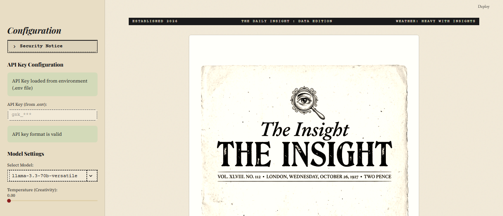
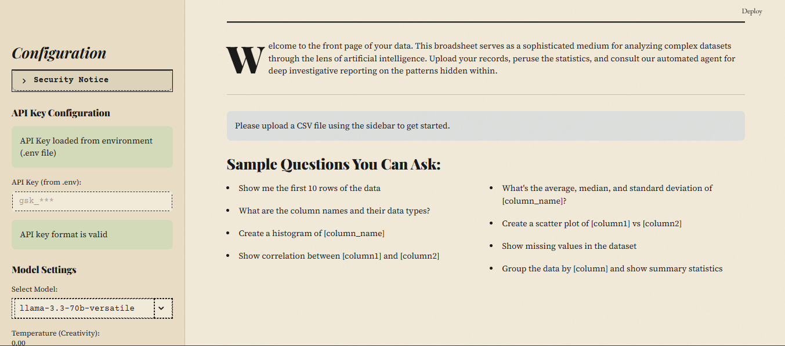
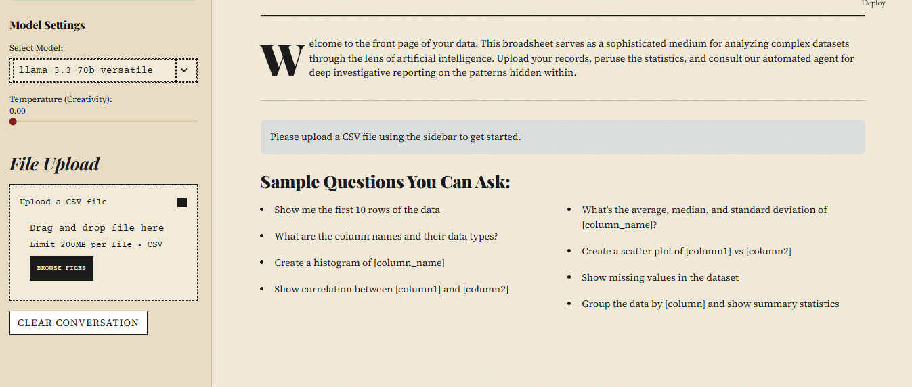
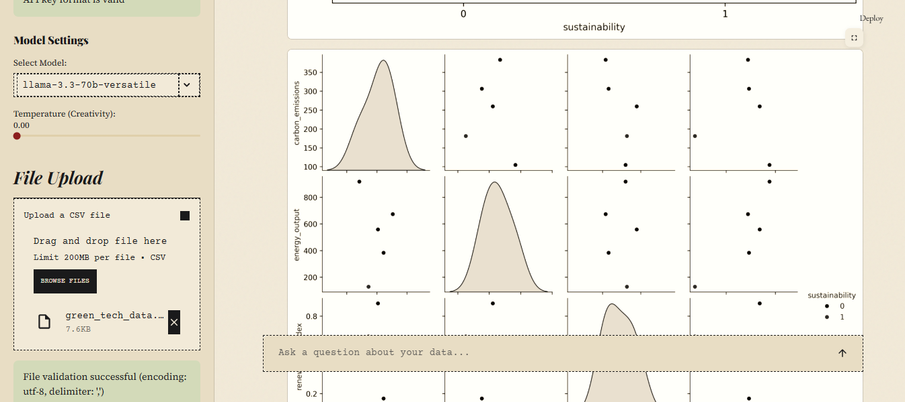

# INSIGHT 📊
### AI-Powered Data Analysis Agent

[](https://python.org)
[](https://streamlit.io)
[](https://langchain.com)
[](LICENSE)
[](https://the-insight-ai.streamlit.app/)

Upload a CSV. Ask anything in plain English. Get newspaper-styled charts and a formatted Word report — no code required.

**[→ Try the live demo](https://the-insight-ai.streamlit.app/)**

---

## What it does

Insight is a conversational data analyst. You bring the data, it brings the reasoning. Under the hood, a LangChain Pandas Agent executes Python against your dataset in a sandboxed environment — you just ask questions.

The full loop:

```
Upload CSV  →  Ask in plain English  →  Get analysis + charts  →  Export .docx report
```

---

## Screenshots

| Upload & Configure | Ask Questions | Generated Charts | Exported Report |
|---|---|---|---|
|  |  |  |  |

## Report Download


---

## Features

**Conversational analysis**
Ask questions the way you'd ask a colleague. "What columns have missing data?", "Show me the correlation between price and quantity", "Which category has the highest average revenue?" — the agent figures out the code, runs it, and explains the result.

**Newspaper-aesthetic visualisations**
Every chart is rendered in a consistent vintage editorial style — `#f2ead8` paper background, ink-black axes, muted classic palette, serif fonts where available. Charts look like they belong in a printed report, not a Jupyter notebook.

**Multi-plot responses**
Complex queries can generate up to 5 charts in a single response, each saved and displayed inline. Scatter plots, histograms, box plots, correlation matrices — whatever the data calls for.

**Docx export**
Export the full conversation — questions, analysis, and embedded charts — as a formatted Word document. The report preserves the newspaper aesthetic: charts print exactly as they appear on screen.

**Multiple model support**
Switch between Groq-hosted models depending on the task:
- `llama3-70b-8192` — best accuracy (default)
- `llama3-8b-8192` — faster responses
- `mistral-saba-24b` — alternative reasoning style
- `compound-beta` — experimental

**Adjustable temperature**
0.0 for deterministic analysis, up to 1.0 for exploratory pattern-finding.

---

## Tech stack

| Layer | Technology |
|---|---|
| UI | Streamlit |
| Agent | LangChain Pandas Agent |
| LLM inference | Groq API (Llama 3, Mistral) |
| Data | Pandas |
| Visualisation | Matplotlib · Seaborn |
| Export | python-docx |
| Config | python-dotenv |

---

## Architecture

```
main.py                  — App entry point, session management, layout
├── agent.py             — DataAnalysisAgent class, LLM orchestration, plot generation
├── ui_components.py     — All Streamlit rendering logic
├── utils.py             — DataFrame loading, session state helpers
├── config.py            — Model list, temperature bounds, app constants
└── style.css            — Custom Streamlit component styling
```

**Agent flow for each query:**

```
User query
    ↓
Enhanced prompt (includes df metadata + vintage chart instructions)
    ↓
LangChain Pandas Agent (executes Python in sandbox)
    ↓
Text analysis  +  temp_plot_N_1.png … temp_plot_N_5.png
    ↓
Rendered in chat  →  optionally exported to .docx
```

The agent is initialised once per config tuple `(api_key, model, temperature)` and cached — reinitialisation only happens when settings change.

---

## Quickstart

**Prerequisites:** Python 3.8+, a free [Groq API key](https://console.groq.com)

```bash
git clone https://github.com/GitTanish/Insight.git
cd Insight
pip install -r requirements.txt
```

Set your API key:
```bash
echo "GROQ_API_KEY=your_key_here" > .env
```

Run:
```bash
streamlit run main.py
```

Open `http://localhost:8501` — upload a CSV and start asking.

---

## Example queries

```
"What are the top 3 most interesting patterns in this dataset?"
"Show me a histogram of the sales column"
"Which month had the highest revenue?"
"Find all rows where quantity > 100 and price < 50"
"Create a correlation matrix for all numeric columns"
"Are there any outliers in the age column?"
"What's the average cost efficiency grouped by category?"
```

---

## Configuration

| Variable | Description | Required |
|---|---|---|
| `GROQ_API_KEY` | Groq API key (starts with `gsk_`) | Yes |

**File limits:**
- Max rows: 1,000,000
- Encodings: UTF-8, Latin-1, CP1252
- Delimiters: comma, semicolon, tab

---

## Security note

The LangChain Pandas Agent executes Python code to answer queries. Execution is sandboxed within the Streamlit environment. Only upload CSV files you trust, and avoid datasets containing sensitive personal information.

---

## Troubleshooting

**"Agent stopped due to max iterations"** — query is too broad. Try something more specific, e.g. *"histogram of column X"* rather than *"analyse everything"*.

**"Invalid API key format"** — key must start with `gsk_`. Get one free at [console.groq.com](https://console.groq.com).

**Charts not appearing** — the agent saves plots to the working directory. Ensure the app has write permissions in the project folder.

**Slow responses** — switch to `llama3-8b-8192` in the sidebar for faster (slightly less accurate) responses.

---

## Contributing

```bash
git checkout -b feature/your-feature
git commit -m 'add: your feature'
git push origin feature/your-feature
# open a pull request
```

---

## Author

**Tanish Saroj** · [github.com/GitTanish](https://github.com/GitTanish) · [linkedin.com/in/tanishsaroj](https://linkedin.com/in/tanishsaroj)

---

*Built with [Groq](https://groq.com) · [LangChain](https://langchain.com) · [Streamlit](https://streamlit.io)*
