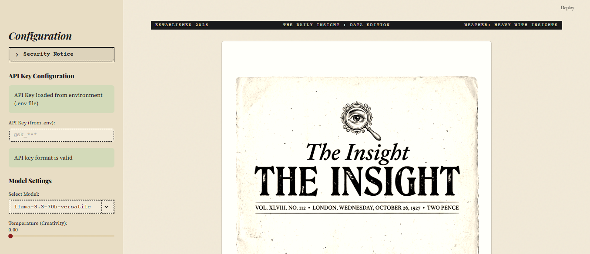
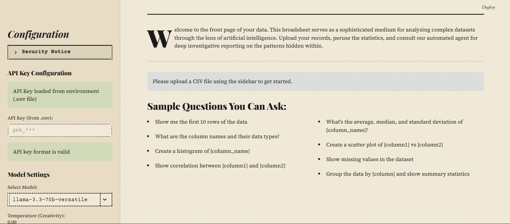
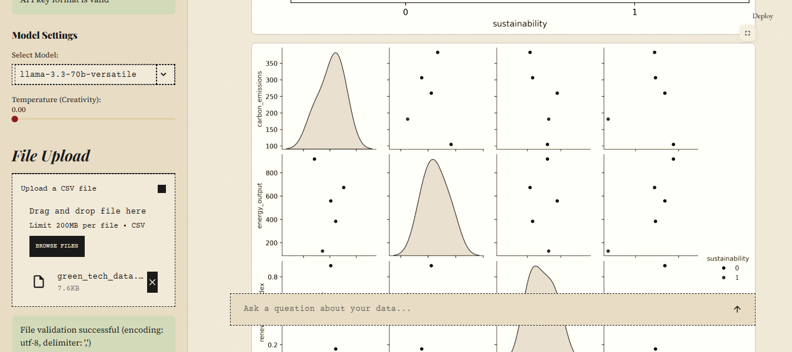
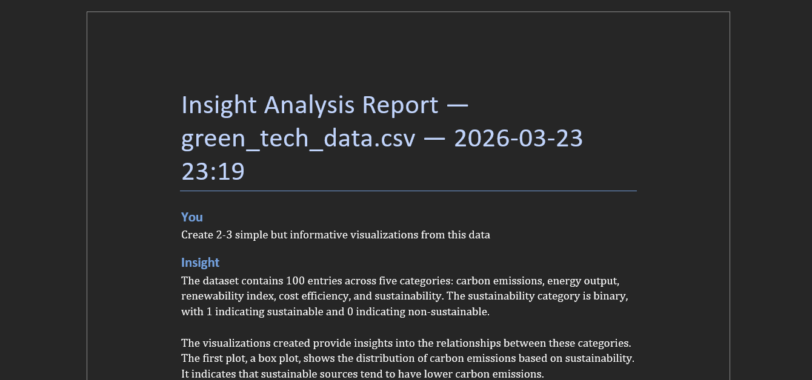

# INSIGHT 📊
### A validated, model-agnostic analytical agent

[](https://python.org)
[](https://fastapi.tiangolo.com)
[](https://docs.pydantic.dev)
[](#5-run-the-test-suite-optional-but-encouraged)
[](LICENSE)

Upload a CSV — or drop four related ones. Ask anything in plain English. Get verified answers, newspaper-styled charts, a formatted Word report, and production-ready dbt/alert exports.

**[→ Try the live demo](https://the-insight-ai.streamlit.app/)**

---

## Proof, not promises

Measured on this repo during development — not aspirational numbers:

| Anchor metric | What it proves |
|---|---|
| **20/20** golden-question eval cases passed live (Groq · Mistral · opencode) | the no-invented-numbers policy holds end-to-end |
| **250K rows**: profiled in **2.0s**, heaviest op **<2s**, bivariate OLS in **125ms** | deterministic engine at real scale, not toy data |
| **−31.7% Brier score** after isotonic recalibration; over-confidence flagged at **ECE = 0.245** | calibration audits quantify, not guess |
| **≤0.13% aggregate drift** under 5% MCAR missingness → graceful **0.60% @ 35%**, with explicit MCAR caveats | honest missing-data behavior, surfaced not hidden |
| Engine answered diamonds' top cut as **Premium ($4,584 avg)** where LLM priors say *Ideal* | computed evidence beats model priors |
| **8/8 malicious SQL patterns blocked** (`DROP`, `COPY TO`, `ATTACH`, `PRAGMA`, chained statements…) + hard **10s interrupt** on runaway queries | read-only relational analytics you can hand to an LLM |
| **16-question real-world battery** (54K-row diamonds + a messy 4-sheet clinical workbook with case-mismatched join keys) logged in [evaluation/REAL_WORLD_LOG.md](evaluation/REAL_WORLD_LOG.md), each answer cross-checked against independent pandas/scipy ground truth | survives data the way it actually arrives |
| **215 offline tests**, CI-green with zero API keys, every headline number independently recomputed through a second arithmetic path — and every number in the *narrative* traced back to computed evidence | verified by construction |

---

## How it works

Insight v2 is built on one principle: **the LLM is not the analytics engine.**

```
Upload CSV
    ↓
Dataset Profiler ──► types, missingness, cardinality → dataset fingerprint
    ↓
Zero-Prompt Briefing ──► top-3 findings immediately, no question needed
    ↓                    (outliers · trends · correlations · imbalance · quality)
Planner (LLM) ────► JSON AnalysisPlan ──► schema + column validated
    ↓                                   └─ invalid? bounded repair loop
Deterministic Engine ──► 15 operations (14 fixed pandas/scipy ops + embedded
    ↓                     DuckDB SQL) chained via input_step DAG
Statistical Router ──► Welch t-test / Mann-Whitney U / chi-square + Cramér's V
    ↓                    / one-way ANOVA + η² — auto-routed by column types
Result Validator ──► non-finite values, empty results, small samples,
    ↓                 missingness caveats (MCAR assumption) + INDEPENDENT
    ↓                 RECOMPUTATION of every headline number through a
    ↓                 second arithmetic path
Conversation State ──► active filters/dims/metrics persist across turns;
    ↓                    follow-ups become filter patches, not re-interpretation
Explainer (LLM) ──► narrative citing only computed values
    ↓
Answer + Evidence + Charts ──► streamed live (SSE) · exportable as .docx
```

Every claim in an answer traces back to a calculation you can inspect via **View calculation**, and every plan step is auditable via **View plan**. If a plan fails validation or execution, the orchestrator repairs and retries — once — then tells you exactly what went wrong instead of hallucinating.

With `INSIGHT_PLAN_APPROVAL=on` the pipeline inserts a human gate between the planner and the engine: you see the exact operations, can edit the JSON, and only then approve. Nothing touches your data until you do.

---

## Features

- **Zero-prompt briefing** — the moment a CSV lands, deterministic detectors surface the three most important findings (trend breaks, outliers, strong correlations, class imbalance, data quality), each with an *Investigate* button.
- **Verified answers** — a validator checks sanity and small-sample caveats; an independent recomputation layer re-derives aggregates through a second code path and flags any mismatch before you see the answer.
- **Statistical tests without statistics mistakes** — binary-vs-numeric questions route to Welch's t-test or Mann–Whitney U with Cohen's d and plain-language group differences ("Class 1 averages 32% lower"); categorical pairs get chi-square with Cramér's V; 3+ groups vs numeric route to one-way ANOVA with η². Point-biserial correlation traps are actively blocked.
- **Regression & calibration** — OLS via `np.linalg.lstsq` with t-stat p-values, R² and standardized betas; `isotonic_calibration` audits whether a score truly tracks a binary outcome (PAV fit, reliability table, Brier before/after recalibration, ECE).
- **Honest missing-data handling** — every op coerces/drops explicitly; listwise deletions are reported (`rows_excluded_incomplete`, mixed count bases flagged), and referenced columns >5% missing raise an explicit MCAR-assumption caveat in the answer.
- **Conversation state machine** — filters applied in earlier turns persist as structured state; "now only 2025" becomes a filter patch instead of the model re-guessing context.
- **Relational analytics on embedded DuckDB** — drop 2–6 related CSVs, or a multi-sheet Excel workbook where **every sheet becomes its own table**. Ask for JOINs, window functions, per-group rankings and pivots via the sandboxed `sql_query` op: in-memory only, external access disabled, config locked, SELECT/WITH-only with keyword guards, interrupt-based timeout, hard row caps. Runtime errors flow straight into the existing plan-repair loop — self-correction without a code interpreter.
- **Actionable artifact exports** — any SQL answer ships two buttons: **Export dbt model** (a `.sql` model + `schema.yml` with column tests, zipped) and **Alert monitor** (a Slack-ready webhook monitor descriptor with the query, cron schedule and payload template).
- **Chained "why" analysis** — plans are DAGs: `filter_rows → group_aggregate → statistical_test` compose via explicit `input_step` references.
- **Editorial charts that never look broken** — adaptive Freedman–Diaconis/Sturges binning, sparse-bin merging, cardinality-aware titles, automatic "Other" bucketing for long tails, horizontal-bar fallback for long labels, human tick formatting (12.5K / 3.2M).
- **Model-agnostic plug-and-play** — Groq, Mistral, OpenAI, Anthropic, OpenRouter, Ollama, or any OpenAI-compatible endpoint via env vars. Automatic cross-provider fallback on rate limits, 5xx — *and empty responses*, which reasoning endpoints occasionally emit mid-plan.
- **Token-by-token answer streaming** — the explainer streams over SSE into a live typing bubble, so the first words land in ~1s instead of after a multi-second blank wait. Time-to-first-token is measured and shown in the timing chip.
- **Human-in-the-loop plan approval** — with `INSIGHT_PLAN_APPROVAL=on`, every question stops at an editable plan (the exact operations, as JSON) that you approve before anything runs. Approved plans are *re-validated against your schema*, so a hand-edit naming a nonexistent column is rejected rather than silently trusted.
- **Live pipeline streaming** — watch *Planning → Executing → Validating → Explaining* happen in real time over SSE.
- **Headless JSON API** — `POST /api/query` exposes the same verified pipeline for scripts and integrations. Send `plan_only: true` to get a reviewable plan back instead of an answer.
- **Query-result cache** — identical (dataset hash, question, model, temperature, session state) hits are served from `.artifacts/cache/` with TTL + size-budget eviction (`INSIGHT_QUERY_CACHE=off` to disable). Serves the streaming UI path too: ~20× faster on repeats.
- **Prefix-cached prompts** — the planner's system prompt stays byte-stable per dataset (per-turn state lives in later messages, not the prefix), so providers serve it from their prompt cache. Reported as `cached_prompt_tokens`.
- **Golden-question eval harness** — 20 seeded/real benchmark cases (incl. the 54K-row diamonds dataset and a 250K-row synthetic retail set) with exact ground truth; `python evaluation/run_eval.py --model <id>` produces a per-case PASS/FAIL markdown report.
- **Observability** — optional LangSmith tracing of every plan, step, and LLM call.

---

## Screenshots

| Upload & Configure | Ask Questions |
|---|---|
|  |  |

| Generated Charts | Exported Report |
|---|---|
|  |  |

---

## Quickstart

**Prerequisites:** Python 3.10+ (3.11 recommended) and a free [Groq API key](https://console.groq.com).

### 1. Clone and set up a virtual environment

```bash
git clone https://github.com/GitTanish/Insight.git
cd Insight

python -m venv .venv
# Windows
.venv\Scripts\activate
# macOS / Linux
source .venv/bin/activate
```

### 2. Install dependencies

```bash
pip install -r requirements.txt
```

### 3. Add your API key (or keys)

Copy the template and fill in whichever providers you use:

```bash
cp .env.example .env
```

Minimum viable setup:

```bash
# Required — pick at least one provider
GROQ_API_KEY=gsk_your_key_here

# Optional — any of these unlock additional models + cross-provider fallback
MISTRAL_API_KEY=your_key_here
OPENAI_API_KEY=your_key_here
ANTHROPIC_API_KEY=your_key_here
OPENROUTER_API_KEY=your_key_here
```

Or export directly:

```bash
# Windows
set GROQ_API_KEY=gsk_your_key_here
# macOS / Linux
export GROQ_API_KEY=gsk_your_key_here
```

### 4. Run

**Primary — FastAPI web server:**

```bash
uvicorn webapp.app:app --port 8000
```

Open `http://localhost:8000`. You get the full editorial UI plus live pipeline streaming (Planning → Executing → Validating → Explaining) and a JSON API at `POST /api/query`.

**Alternative — classic Streamlit UI:**

```bash
streamlit run main.py
```

Both front-ends share the same `insight/` engine.

**Alternative — Docker:**

```bash
docker build -t insight .
docker run -p 8000:8000 --env-file .env insight
```

No local Python or virtualenv needed. The image runs unprivileged as a non-root user, binds to `0.0.0.0:8000`, and ships a `/healthz` healthcheck. Keys stay outside the image — they're read from `--env-file` at runtime.

### 5. Run the test suite (optional but encouraged)

```bash
pytest
```

215 unit/integration tests cover the profiler, every analytics operation (including statistical routing), the DAG executor, the validator + independent recomputation layer, planner repair loops, chart rendering rules, the briefing engine, conversation state, the query cache, text streaming, plan approval, prompt-cache stability, and the FastAPI webapp end-to-end — all via a scripted fake LLM, no API key needed. CI generates the deterministic eval datasets before running (`python evaluation/generate_datasets.py`); one further test runs when the optional `diamonds.csv` corpus is present. A separate `eval`-marked live suite (`INSIGHT_RUN_EVAL=1 pytest -m eval`) exercises the golden-question harness against a real provider.

### Evaluation harness (optional)

Benchmark the full pipeline against deterministic datasets with known ground truth:

```bash
python evaluation/generate_datasets.py          # writes sales/ecommerce/support/retail_250k CSVs
python evaluation/run_eval.py --model groq/openai/gpt-oss-120b
# → per-case PASS/FAIL + markdown report under .artifacts/eval/
```

Real-world runs are recorded in [evaluation/REAL_WORLD_LOG.md](evaluation/REAL_WORLD_LOG.md):
the question battery, ops executed per answer, timings, grounding flags, plus an
independent ground-truth verification section (including the data-quality traps the
engine had to navigate — case-mismatched join keys, inconsistent state codes).

---

## Providers (plug and play)

Insight is **model-agnostic**: every provider sits behind one `LLMProvider` interface, and the app auto-detects whichever you configure. Set any subset of these in `.env` — missing keys simply hide that provider.

| Provider | Key | Models |
|---|---|---|
| **Groq** *(default)* | `GROQ_API_KEY` | gpt-oss-120b / gpt-oss-20b, qwen3.8-27b |
| **Mistral** | `MISTRAL_API_KEY` | mistral-small / medium-latest |
| **OpenAI** | `OPENAI_API_KEY` | gpt-4o family + live discovery |
| **Anthropic** | `ANTHROPIC_API_KEY` | Claude models + live discovery |
| **OpenRouter** | `OPENROUTER_API_KEY` | 400+ aggregated models, curated discovery |
| **Ollama** (local) | `OLLAMA_BASE_URL` or `INSIGHT_ENABLE_OLLAMA=1` | whatever you have pulled |
| **Any OpenAI-compatible service** | `INSIGHT_CUSTOM_BASE_URL` + `INSIGHT_CUSTOM_API_KEY` (+ `INSIGHT_CUSTOM_MODELS`) | DeepSeek, Together, Fireworks, vLLM, LM Studio… |

See [.env.example](.env.example) for the full template. Model capabilities (JSON mode, reasoning effort) are declared per model; the orchestrator strips unsupported parameters automatically and falls back across providers when a 429/5xx hits. Copy `.env.example` to `.env` and fill in what you have:

```bash
cp .env.example .env
```

---

## Configuration

File limits: up to 1,000,000 rows · CSV (UTF-8/Latin-1/CP1252, delimiters `,` `;` `\t`) · Excel `.xlsx`/`.xls`/`.xlsm` with one table registered per non-empty sheet.

| Variable | Default | Purpose |
|---|---|---|
| `INSIGHT_SQL` | `on` | enable the embedded DuckDB `sql_query` op |
| `INSIGHT_SQL_TIMEOUT_S` | `10` | hard interrupt for runaway queries |
| `INSIGHT_SQL_MAX_ROWS` | `10000` | result-set cap before display truncation |
| `INSIGHT_QUERY_CACHE` | `on` | cache identical (dataset, question, model, temp, state) results under `.artifacts/cache/` |
| `INSIGHT_QUERY_CACHE_TTL_DAYS` | `14` | cache entries older than this are evicted |
| `INSIGHT_QUERY_CACHE_MAX_MB` | `512` | size budget; oldest entries evicted first |
| `INSIGHT_BRIEFING_LLM_POLISH` | `off` | one extra fast LLM call to sharpen briefing headlines (numbers frozen). Runs in the background — the upload response never waits on it. |
| `INSIGHT_PLAN_APPROVAL` | `off` | stop at an editable plan for review before executing (`on`) |

**Deployment note:** the webapp is single-worker by design — sessions (CSV bytes, profile, turns) live in process memory. Run exactly one uvicorn worker; horizontal scaling requires externalizing session state first. Put a TLS-terminating reverse proxy in front before exposing beyond localhost; there is no built-in auth or rate limiting.

---

## Project structure

```
webapp/                  FastAPI UI (primary)
├── app.py               routes: upload / SSE query stream / export / JSON API / models refresh
├── sessions.py          cookie-keyed server-side sessions (single-worker)
├── services.py          Streamlit-free CSV/profile helpers
├── templates/           Jinja2 (base, index, partials)
└── static/              editorial CSS + SSE client glue
main.py                  Streamlit entry point (legacy UI, same engine)
├── ui_components.py     Streamlit rendering layer
├── utils.py             cached wrappers (delegates DOCX to insight/reports)
├── style.css            editorial styling
├── insight/             ← the engine (UI-agnostic)
│   ├── domain/          Pydantic v2 contracts: profiles, plans, results, errors
│   ├── llm/             Provider ABC, OpenAI-compatible base, Groq/Mistral/OpenRouter/..., registry
│   ├── profiling/       Dataset profiler + fingerprinting
│   ├── planning/        Planner (structured output + repair), prompt builders
│   ├── analytics/       Deterministic operation library (15 ops incl. DuckDB sql_query)
│   ├── briefing.py      zero-prompt top-findings engine (+ optional LLM polish flag)
│   ├── conversation/    AnalysisSessionState — filters/dims/metrics across turns
│   ├── execution/       Plan executor (sync core, async wrapper, input_step DAG)
│   ├── validation/      Result validator + independent recomputation checks
│   ├── cache.py         query-result cache (TTL + size-budget eviction)
│   ├── reports/         shared DOCX builder + dbt/alert artifact generators
│   ├── visualization/   Editorial theme + chart renderer from ChartSpec
│   └── orchestrator.py  plan → execute → validate → repair → render → explain (+ streaming variant)
├── evaluation/          golden-question harness: generator, 20 cases, scorer/reporter
└── tests/               pytest suite (fake LLM, zero network needed)
```

The `insight/` package is deliberately UI-agnostic — both front-ends call it through one function. The FastAPI app additionally exposes the pipeline as an SSE stream and a JSON API, so CLIs and future clients reuse the exact same verified engine.

---

## Example queries

```
"Which region has the highest revenue?"
"Why did revenue fall between Q2 and Q3?"            ← chained DAG plan
"Join orders to customers and rank each customer's biggest order"  ← DuckDB window fn
"Is the conversion difference between groups real?"  ← auto t-test / Mann-Whitney
"Do handle times differ across priority levels?"     ← auto one-way ANOVA + η²
"How strongly do price and carat weight correlate?"  ← Pearson/Spearman
"Audit whether lead_score predicts conversion well"  ← isotonic calibration + ECE
"Are treatment and churn associated?"                ← chi-square + Cramér's V
"Create 2-3 visualizations of this data"
"Are there outliers in the price column?"
"What correlates most strongly with quantity?"
"Compare average order value between 2024 and 2025"
```

Every response includes:
- **Answer** — narrative citing only computed numbers, with significance stated where tests ran
- **Charts** — consistent ink-on-paper editorial style
- **View calculation** — the exact result tables behind the claims
- **View plan** — the validated step DAG with parameters and reasons
- **Warnings** — consolidated caveats (small samples, sparse bins, excluded binary correlations)

Export everything — including the upload briefing — as a formatted Word report.

---

## Methods & references

Every statistical claim above is a textbook method executed by deterministic code (`insight/analytics/`). The papers behind them:

**Classical inference** — *Welch's t-test* (Welch, 1947, *Biometrika*), *Mann–Whitney U* (Mann & Whitney, 1947), *chi-square independence* (Pearson, 1900), *Cramér's V* with bias correction (Cramér, 1946), *one-way ANOVA F-test* (Fisher, 1925), t-distribution p-values (Student, 1908). Effect sizes follow Cohen's conventions — Cohen's d (Cohen, 1988) and η² benchmarks (Cohen, 1973).

**Regression** — OLS via least squares (Legendre, 1805; Gauss), coefficient standard errors from σ²(XᵀX)⁻¹, standardized betas and adjusted R² per Montgomery, Peck & Vining, *Introduction to Linear Regression Analysis*.

**Distribution & outliers** — adaptive binning blends Sturges' rule (Sturges, 1926, *JASA*) with the Freedman–Diaconis rule (Freedman & Diaconis, 1981); outlier fences use Tukey's 1.5×IQR rule (*Exploratory Data Analysis*, 1977). Rank-based association via Spearman (1904).

**Probability calibration** — `isotonic_calibration` implements the pool-adjacent-violators algorithm (Ayer et al., 1955; Robertson, Wright & Dykstra, *Order Restricted Statistical Inference*, 1988), scored by the Brier score (Brier, 1950) and expected calibration error in the style of Guo et al. (2017), following the score-to-probability calibration literature (Zadrozny & Elkan, 2002; Niculescu-Mizil & Caruana, 2005).

**LLM reliability patterns** — the planner-emits-plan / engine-computes split follows program-aided language models (Gao et al., *PAL*, ICML 2023); bounded plan-repair mirrors iterative self-refinement (Madaan et al., *Self-Refine*, NeurIPS 2023); independent recomputation of every headline number is an application of chain-of-verification ideas (Dhuliawala et al., 2023).

## Security & privacy

- **No arbitrary code execution:** the LLM does not generate or execute arbitrary Python code. All operations route through a fixed library of audited pandas/scipy functions or a strictly sandboxed, read-only embedded DuckDB engine — everything executes inside your own process.
- **Context protection:** full tabular datasets are never dumped into the LLM context window. The provider receives only schema definitions, statistical fingerprints (column types, cardinality, missingness, sampled summaries), and the small set of computed aggregate values a given answer actually cites.
- **Sanitized SQL:** DuckDB queries are accepted only as a single read-only `SELECT`/`WITH` statement. Destructive and administrative keywords (`ATTACH`, `COPY`, `DROP`, `PRAGMA`, …) are rejected, the connection runs in-memory with external access disabled and configuration locked, results are row-capped, and a hard 10-second interrupt aborts runaway queries.

Still, aggregates and schemas leave your machine: whatever you ask, the numbers behind the answer are sent to your configured provider. Don't upload datasets whose derived statistics you wouldn't paste into a chat model.

---

## Troubleshooting

**`No provider available`** — no `GROQ_API_KEY`/`MISTRAL_API_KEY` found in `.env` or environment.

**`unknown column 'x'` in the answer** — the model referenced a column that doesn't exist; the repair loop already retried. Rephrase using exact column names from the profile expander.

**Rate limit errors** — Groq free tier allows 30 requests/min on gpt-oss models. Wait a moment, switch to `gpt-oss-20b`, or add a Mistral key for fallback.

**Charts not appearing** — check the `.artifacts/web/<session>/` folder is writable; render warnings appear under answers.

**Slow first load** — provider model catalogs are scanned on startup (~10s, cached); the dataset profile and briefing compute once per upload.

**Streamlit vs webapp sessions** — each front-end keeps its own session state; uploads don't transfer between them.

---

## Observability

Set `LANGSMITH_API_KEY` (and optionally `LANGSMITH_PROJECT`) to enable full tracing via [LangSmith](https://smith.langchain.com). Every question produces a root `insight.analyze` run containing:

- the validated **plan** JSON (with repair attempts visible as failed→retried children),
- one **LLM span per provider call** (model, tokens, latency, retries),
- step-level execution results and validation outcomes.

Tracing is fully optional — with no key the engine runs identically and posts nothing.

---

## Roadmap

Completed: zero-prompt briefing ✅ · statistical engine (t-test / Mann-Whitney / chi-square / Cramer's V) ✅ · chained DAG plans ✅ · independent result verification ✅ · FastAPI + SSE front-end ✅ · LangSmith observability ✅ · statistics depth (ANOVA + eta-squared, OLS regression, confidence intervals) ✅ · isotonic calibration audits ✅ · conversation state machine ✅ · golden-question evaluation harness ✅ · Dockerfile + CI + query-result cache with eviction ✅ · embedded DuckDB relational analytics + dbt/alert artifact exports ✅

**Up next** (detailed notes in [HANDOVER.md](HANDOVER.md)):

- External session storage (Redis) for multi-worker deployments
- MAR/MNAR-aware missingness diagnostics (currently MCAR assumption is surfaced as a caveat)
- Streaming cache for the SSE path; PDF export remains deferred

---

## Contributing

```bash
git checkout -b feature/your-feature
git commit -m 'add: your feature'
git push origin feature/your-feature
# open a pull request
```

Run `pytest` before submitting — CI-friendly, no keys required.

---

## Author

**Tanish Saroj** · [github.com/GitTanish](https://github.com/GitTanish) · [linkedin.com/in/tanishsaroj](https://linkedin.com/in/tanishsaroj)

---

*Built with [Groq](https://groq.com) · [Pydantic](https://docs.pydantic.dev) · [FastAPI](https://fastapi.tiangolo.com) · pandas · scipy*
